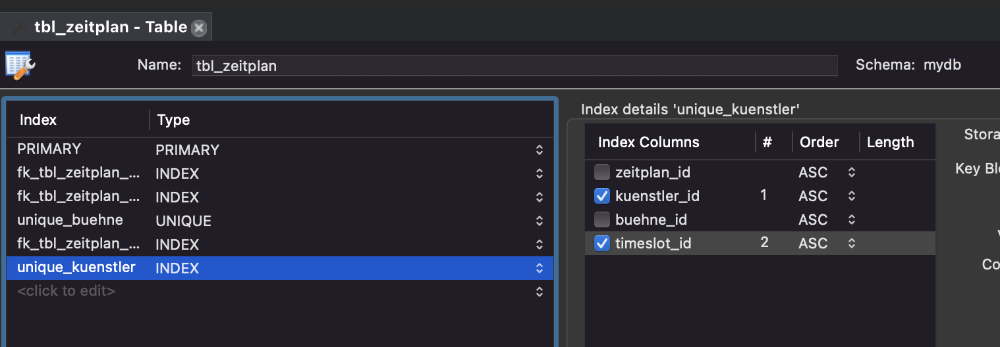
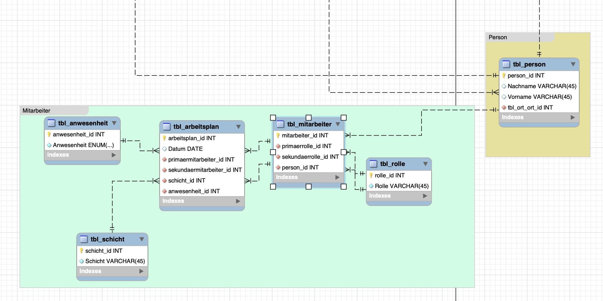

# Projekt Festival-Datenbank

Für ein Musikfestival möchten wir eine Datenbank modellieren. Die Datenbank sollte vorallem Artist- & Bühnemmanagement, Besucher- & Ticketmanagement und Personalmanagement beinhalten.

# Anforderungsanalyse

## Anforderungen Personalmanagement

### **Umfang:** Festival-Datenbank
### **Ebene:** Anwenderziel
### **Primärakteur:** Personalmanager
### **Stakeholder und Interessen:**

- Personalmanager: möchte einen klaren Überblick über das Personal und dessen Schichten, dessen Rollen und dessen Arbeitszeiten
- Personal: möchte genaue Angaben zu ihren Arbeitszeiten & Rollen
- Buchhaltung: Möchte genaue Angaben zu der Arbeitszeit für die Lohnrechnung
- Manager: Will eine reibungslosen Ablauf des Personalmanagements
- Unternehmen: Möchte einen effizienten einsatz des Personals haben
- Behörden: Wollen genaue Angaben zu den Arbeitszeiten, damit Steuertechnisch und Arbeitsgesetzlich alles kontrolliert werden kann

### Abläufe

#### Schichtzuteilung:

- Manager teilt einem Mitarbeiter eine Schicht zu

#### Erfassung eines neuen Mitarbeiters:

- Manager erfasst einen neuen Mitarbeiter

#### Entfernen eines Mitarbeiters aus dem System:

- Mitarbeiter wird gekündet oder kündet und wird aus dem Sytem entfernt

#### Manager teilt einen Mitarbeiter als Reserve ein

- Mitarbeiter wird als Reserve eingeteilt

#### Anwesenheit notieren:

- Nach einer Schicht kann die Anwesenheit / Abwesenheit eines Mitarbeiters eingetragen werden

#### Abmeldung / Krankheitsmeldung

- Mitarbeiter kann Schicht nicht realisieren und daher wird die Reserve benachrichtigt

## Anforderungen Artistbuchung

### Primärakteur

- Artistbucher für Festival-Datenbank

### Umfang:

- Das System soll eine Artistbucher-Funktion für das Festival-Management-System bereitstellen, die es den Organisatoren ermöglicht, Künstler zu buchen und ihre Auftritte zu planen.

### Ebene:

- Das ist ein primärer Use-Case.

### Primärakteur:

- Der Primärakteur ist ein Festival-Organisator oder ein anderer autorisierter Mitarbeiter, der für die Buchung von Künstlern und die Planung ihrer Auftritte verantwortlich ist.

### Stakeholder und Interessen:

- Festival-Organisatoren: Sie möchten ein effizientes und zuverlässiges System zur Buchung von Künstlern und zur Planung ihrer Auftritte.
- Künstler: Sie möchten eine reibungslose Buchung und Planung ihrer Auftritte, um ihre Leistung optimal zu gestalten und ihre Fans zufrieden zu stellen.

### Vorbedingungen:

- Das Festival-Management-System ist eingerichtet und einsatzbereit.
- Der Primärakteur hat Zugang zum System und ist autorisiert, Künstler zu buchen und ihre Auftritte zu planen.

### Nachbedingungen:

- Die gebuchten Künstler und ihre Auftritte sind im System erfasst und können für die Planung und das Management des Festivals genutzt werden.

### Standardablauf:

1. Der Primärakteur wählt die Option "Artistbucher" im Festival-Management-System aus.
2. Das System zeigt eine Liste der verfügbaren Künstler an, aus der der Primärakteur wählen kann.
3. Der Primärakteur wählt den gewünschten Künstler aus der Liste aus.
4. Das System zeigt eine Liste der verfügbaren Bühnen und Zeitslots an, auf denen der Künstler auftreten kann.
5. Der Primärakteur wählt die gewünschte Bühne und den gewünschten Zeitslot aus.
6. Das System überprüft, ob die ausgewählte Bühne und der ausgewählte Zeitslot verfügbar sind und ob der Künstler zu dieser Zeit noch verfügbar ist.
7. Wenn die Bühne und der Zeitslot verfügbar sind und der Künstler zu dieser Zeit noch nicht gebucht ist, bestätigt das System die Buchung und fügt sie der Datenbank hinzu.
8. Das System aktualisiert die Verfügbarkeit des Künstlers und der Bühne in der Datenbank.

### Erweiterungen:

- Wenn die ausgewählte Bühne oder der ausgewählte Zeitslot nicht verfügbar ist oder der Künstler bereits zu dieser Zeit gebucht ist, zeigt das System eine entsprechende Fehlermeldung an und der Primärakteur kann eine andere Option auswählen.
- Die Buchung wird in der Datenbank gespeichert und kann später bearbeitet oder storniert werden.
- Die Künstler- und Bühnenpläne werden automatisch aktualisiert, um Doppelbuchungen zu vermeiden.
- Der Primärakteur kann zusätzliche Informationen, wie z.B. technische Anforderungen oder besondere Bedürfnisse des Künstlers, hinzufügen.
- Das System kann eine Bestätigungsmail an den Künstler senden, um die Buchung zu bestätigen.

### Spezielle Anforderungen:

- Das System muss in der Lage sein, eine Doppelbuchung von Künstlern und Bühnen zu verhindern.
- Das System sollte eine Übersicht über alle gebuchten Künstler und ihre Auftritte bieten.
- Das System sollte es dem Primärakteur ermöglichen,mehrere Künstler und ihre Auftritte auf einmal zu buchen oder zu ändern.
- Das System sollte es dem Primärakteur ermöglichen, die Verfügbarkeit von Künstlern und Bühnen schnell und einfach zu überprüfen.

### Liste der Technik- und Datenvariationen:

- Das System nutzt MySQL für die Datenbank

### Häufigkeit des Auftretens:

- Die Artistbucher-Funktion wird von den Festival-Organisatoren regelmässig genutzt, um Künstler zu buchen und ihre Auftritte zu planen.
- Die Häufigkeit hängt von der Grösse des Festivals und der Anzahl der gebuchten Künstler ab.

### Verschiedenes:

- Die Artistbucher-Funktion ist ein wichtiger Bestandteil des Festival-Management-Systems und trägt wesentlich zur erfolgreichen Planung und Durchführung des Festivals bei.
- Durch die Nutzung des Systems können Doppelbuchungen vermieden und die Verfügbarkeit von Künstlern und Bühnen effektiv verwaltet werden.

## Anforderungen Ticketverkauf

### Primärakteur

- Ticketverkaufsmanager

### Umfang:

- Das System soll eine Ticketverkaufsmanagement-Funktion für das Festival-Management-System bereitstellen, die es den Organisatoren ermöglicht, den Verkauf von Tickets zu verwalten und zu überwachen.

### Ebene:

- Das ist ein primärer Use-Case.

### Primärakteur:

- Der Primärakteur ist ein Festival-Organisator oder ein anderer autorisierter Mitarbeiter, der für den Verkauf von Tickets und die Überwachung des Ticketverkaufs verantwortlich ist.

### Stakeholder und Interessen:

- Festival-Organisatoren: Sie möchten ein effizientes und zuverlässiges System zur Verwaltung und Überwachung des Ticketverkaufs.
- Ticketkäufer: Sie möchten ein einfaches und bequemes Verfahren zum Kauf von Tickets, das ihnen eine sichere und reibungslose Teilnahme am Festival ermöglicht.

### Vorbedingungen:

- Das Festival-Management-System ist eingerichtet und einsatzbereit.
- Der Primärakteur hat Zugang zum System und ist autorisiert, den Ticketverkauf zu verwalten und zu überwachen.

### Nachbedingungen:

- Der Ticketverkauf wird erfolgreich abgeschlossen und die Käufer erhalten ihre Tickets.

### Standardablauf:

1. Der Primärakteur wählt die Option "Ticketverkauf" im Festival-Management-System aus.
2. Das System zeigt eine Liste der verfügbaren Tickettypen und Preise an, aus der der Primärakteur wählen kann.
3. Der Primärakteur wählt den gewünschten Tickettyp und die Anzahl der Tickets aus.
4. Das System zeigt eine Zusammenfassung des Kaufs und den Gesamtpreis an.
5. Der Käufer gibt seine Zahlungsinformationen ein und bestätigt den Kauf.
6. Das System generiert die Tickets und sendet sie an den Käufer per E-Mail oder ermöglicht den Ausdruck der Tickets.
7. Das System aktualisiert den Ticketverkauf in der Datenbank und gibt eine Bestätigung des Kaufs aus.

### Erweiterungen:

- Das System kann verschiedene Zahlungsmethoden akzeptieren, wie z.B. Kreditkarten, PayPal oder TWINT.

### Spezielle Anforderungen:

- Das System muss in der Lage sein, den Ticketverkauf zu überwachen und zu verwalten, um eine ausreichende Verfügbarkeit von Tickets sicherzustellen und eine Überbuchung zu vermeiden.
- Das System sollte es dem Primärakteur ermöglichen, Tickets zu stornieren oder umzubuchen, wenn dies erforderlich ist.
- Das System sollte sicherstellen, dass Tickets nur einmal verkauft werden und keine Doppelbuchungen auftreten.

### Liste der Technik- und Datenvariationen:

- Das System nutzt MySQL als Datenbank-Management-System.

### Häufigkeit des Auftretens:

- Der Ticketverkauf wird in der Regel in regelmässigen Abständen stattfinden, bevor das Festival stattfindet.
- Die Häufigkeit hängt von der Grösse des Festivals, der Anzahl der verfügbaren Tickets und der Nachfrage ab.

### Verschiedenes:

- Das Ticketverkaufsmanagement ist ein wichtiger Bestandteil des Festival-Management-Systems und trägt wesentlich zur erfolgreichen Durchführung des Festivals bei.
- Durch die Nutzung des Systems können der Verkauf und die Überwachung von Tickets effektiv verwaltet werden, was dazu beiträgt, dass das Festival reibungslos abläuft und die Zufriedenheit der Teilnehmer erhöht wird.

# Arbeitsschritte

1. Analyse der Anforderungen an die Festival-Datenbank
2. Identifizierung der beteiligten Stakeholder und deren Interessen
3. Definition von Anwenderzielen und Primärakteuren
4. Analyse der Anforderungen an das Personalmanagement-Modul und Definition der erforderlichen Funktionen und Abläufe
5. Analyse der Anforderungen an das Artistbuchungsmodul und Definition der erforderlichen Funktionen und Abläufe
6. Erstellung eines Datenbankmodells, das alle erforderlichen Informationen und Beziehungen zwischen den verschiedenen Modulen enthält
7. Generieren der Datenbank
8. Einfügen von Testdaten
9. Durchführung von Tests, um sicherzustellen, dass alle Funktionen wie erwartet funktionieren.

# Überblick ERD

## Bühnenmanagement

Für das Bühnenmanagement war unser Ziel dass wir Künstler Buchen können und sie auf die verschiedenen Bühnen mit einem Zeitplan verteilen können.

Um dieses Management Umzusetzen haben wir eine Tabelle "tbl_zeitplan" erstellt. Diese Tabelle beinhaltet 3 Fremdschlüssel. Die Fremdschlüssel beziehen sich auf die Tablelle "tbl_buehne", die Tabelle tbl_timeslot und die Tabelle "tbl_kuenstler". Diese Tabellen, wie vom Namen her zu vermuten, beinhalten die Bühnen, die Künstler und die definierten Timelots.

Auf der Tabelle Zeitplan existieren 2 Indezes, einer bezogen auf Timeslot und Bühne und der andere auf Timeslot und Künstler. Dies ist so eingerichtet, damit keine Doppelbuchung von Bühnen und Künstler passieren können.

## Kundenmanagement / Ticketmanagement

Für das Kundenmanagement war das Ziel dass wir einen Datenstruktur bieten, mit der Kunden Tickets in einem Onlineshop erwerben können.

Um dies Umzusetzen, haben wir 5 Haupttabellen definiert "tbl_besucher", "tbl_kauefer", "tbl_ticketberechtigungen", "tbl_ticket" und "tbl_tage". Dies erlaubt uns in einer Applikation einen Ticketverkauf zu implementieren, der Tickets für die verschiedenen Festivaltage mit verschiedenen Berechtigungen zur verfügung stellt. Es wurde eine Auftrennung von Käufer und Besucher gemacht, so dass zu einem Ticket ein Käufer und ein Besucher dazugehört. Somit kann eine Person für andere Personen Tickets erwerben.

Es existieren zwei Zwischentabellen. Die Zwischentabelle zwischen Tickets und Ticketberechtigungen, bietet uns die Möglichkeit einem Ticket eine oder mehrere Berechtigungen zuzuteilen. Die zweite Zwischentabelle liegt zwischen Ticket und Tage. Mit dieser Tabelle können wir auf einem Ticket den Zutritt zu einem oder mehreren Tagen definieren.

Es existieren keine spezielle Constraints sondern nur einzelne Not-Null- und Unique-Constraints die anhand von normalen Menschenverstand gesetzt wurden.

## Personalmanagement

Screenshot noch anpassen!

Unser Ziel für das Personalmanagement war, dass die Datenbank die primäre und sekundäre Rolle eines Mitarbeiters erfassen kann und den Arbeitsplan mit Schicht für ein gewisses Datum speichern kann.

Um dieses Management Umzusetzen haben wir eine Tabelle "tbl_mitarbeiter" erstellt. Diese Tabelle beinhaltet 3 Fremdschlüssel. Die Fremdschlüssel beziehen sich zwei Mal auf die Tablelle "tbl_rolle" und auf die Tabelle "tbl_person". In diesen Tabellen geht um die Rollen (primär & sekundär) die ein Mitarbeiter hat.

Diese Implementierung erlaubt uns die Vorgaben, dass ein Mitarbeiter mehrere Rollen hat und eine Schicht einen Hauptmitarbeiter und einer Reserve hat, zu erfüllen.

Wir haben zwei wichtige Constraints auf der Tabelle Arbeitsplan. Wir haben einen Unique auf den fk_schicht und fk_hauptmitarbeiter und einen Unique auf fk_schicht und fk_reserve. Somit können wir die Doppelbuchung von Hauptmitarbeiter und Reservermitarbeiter auf eine Schicht vermeiden.

## Schnittstelle Personen

### Bühnenmanagement

Das Bühnenmanagement hat eine Zwischentabelle "tbl_person_has_tbl_kuenstler" welche die Verbindung von Künstler / Band zu einer Person / mehreren Personen herstellt. Dies existiert damit wir einzelnen Künstler, Duos und Bands mit den beteiligten Personen verbinden können.

### Ticketmanagement

Die zwei Tabellen "tbl_kauefer" und "tbl_besucher" sind direkt mit der Tabelle Personen verbunden. Ein Gedanke der wir hatten war, dass man eine Zwischentabelle zwischen tbl_besucher, tbl_kauefer und Personen machen könnte. Dann könnten Constraints gesetzt werden, die z.B. den Kauf von 20 Tickets von der gleichen Person verhindern könnten. Wir sind jedoch zu der Schlussfolgerung gekommen, dass es besser wäre diese Logik auf die Applikation auzulagern.

### Personalmanagement

Die Tabelle Mitarbeiter ist mit der Tabelle "tbl_person" verbunden. Somit teilt auch dieses System mit den anderen zwei Systemen den gleichen Kern.

# Testfälle

| Testfall | Schritte | Erwartetes Ergebnis | Ergebnis |
| -------- | ------- | ------------------ | -------- |
| Neuer Mitarbeiter | 1. Gebe die relevanten Informationen für einen neuen Mitarbeiter in das System ein. | Der neue Mitarbeiter wird in der Datenbank gespeichert. | Positiv |
| | 2. Überprüfe, ob der neue Mitarbeiter in der Datenbank gespeichert wurde. | Der neue Mitarbeiter ist in der Datenbank vorhanden. | Positiv|
| | 3. Stelle sicher, dass die Informationen, die vom System zurückgegeben werden, korrekt sind. | Die zurückgegebenen Informationen sind korrekt. |Positiv |
| Mitarbeiter als Reserve eintragen | 1. Wähle einen Mitarbeiter aus und markiere ihn als Reserve. | Der Mitarbeiter wird als Reserve eingetragen. | Positiv|
| | 2. Überprüfe, ob der Mitarbeiter erfolgreich als Reserve eingeteilt wurde. | Der Mitarbeiter ist als Reserve eingetragen. |Positiv |
| | 3. Stelle sicher, dass der Mitarbeiter in der Datenbank entsprechend gekennzeichnet ist. | Der Mitarbeiter ist in der Datenbank als Reserve gekennzeichnet. | Positiv|
| Mitarbeiter einer Schicht zuweisen | 1. Wähle einen Mitarbeiter aus und teile ihm eine Schicht zu. | Der Mitarbeiter wird der Schicht zugewiesen. | Positiv|
| | 2. Überprüfe, ob der Mitarbeiter erfolgreich der Schicht zugeordnet wurde. | Der Mitarbeiter ist der Schicht zugewiesen. | Positiv|
| | 3. Stelle sicher, dass die Schichtinformationen in der Datenbank korrekt sind. | Die Schichtinformationen sind in der Datenbank korrekt. | Positiv|
| Anwesenheit eines Mitarbeiters notieren | 1. Wähle einen Mitarbeiter aus und markiere ihn als anwesend oder abwesend nach einer Schicht. | Die Anwesenheitsinformationen werden in der Datenbank gespeichert. |Positiv |
| | 2. Überprüfe, ob die Anwesenheitsinformationen in der Datenbank korrekt gespeichert wurden. | Die Anwesenheitsinformationen sind korrekt gespeichert. |Positiv |
| | 3. Stelle sicher, dass die Informationen, die vom System zurückgegeben werden, korrekt sind. | Die zurückgegebenen Informationen sind korrekt. | Positiv|
| Mitarbeiter entfernen | 1. Entferne einen Mitarbeiter aus dem System. | Der Mitarbeiter ist nicht mehr in der Datenbank vorhanden. |Positiv |
| | 2. Überprüfe, ob der Mitarbeiter nicht mehr in der Datenbank vorhanden ist. | Der Mitarbeiter ist nicht mehr in der Datenbank vorhanden. |Positiv |
| | 3. Stelle sicher, dass alle Informationen über den Mitarbeiter und seine Schichten aus der Datenbank entfernt wurden. | Alle Informationen über den Mitarbeiter und seine Schichten wurden aus der Datenbank entfernt. |Positiv |
| Abmeldung/Krankheitsmeldung | 1. Ein Mitarbeiter meldet sich krank oder meldet sich ab und benachrichtigt die Reserve. | Die Abwesenheitsinformationen werden in der Datenbank gespeichert. | Positiv|
| | 2. Überprüfe, ob die Informationen über die Abwesenheit des Mitarbeiters in der Datenbank gespeichert wurden. | Die Abwesenheitsinformationen sind korrekt gespeichert. | Positiv|
| | 3. Stelle sicher, dass die Reserve korrekt benachrichtigt wurde. | Die Reserve wurde korrekt benachrichtigt. | Positiv|

# Zeitplan

| Meilenstein                          | Geplantes Datum          | Effektives Datum     |
| ------------------------------------| --------------| ---------------------|
| Projektstart                        | 1. März 2023   | 1. März 2023   |
| Abschluss der Planung               | 10. März 2023  | 10. März 2023  |
| Fertigstellung Entwurf              | 17. März 2023  | 17. März 2023  |
| Erste Überprüfung                   | 24. März 2023  | 24. März 2023  |
| Überarbeitung des Entwurfs          | 31. März 2023  | 31. März 2023  |
| Testdaten einfügen & Tests durchführen | 7. April 2023 | 7. April 2023 |
| Fertigstellung des Endprodukts      | 14. April 2023 | 14. April 2023 |
| Abschlusspräsentation               | 21. April 2023 | 21. April 2023 |
