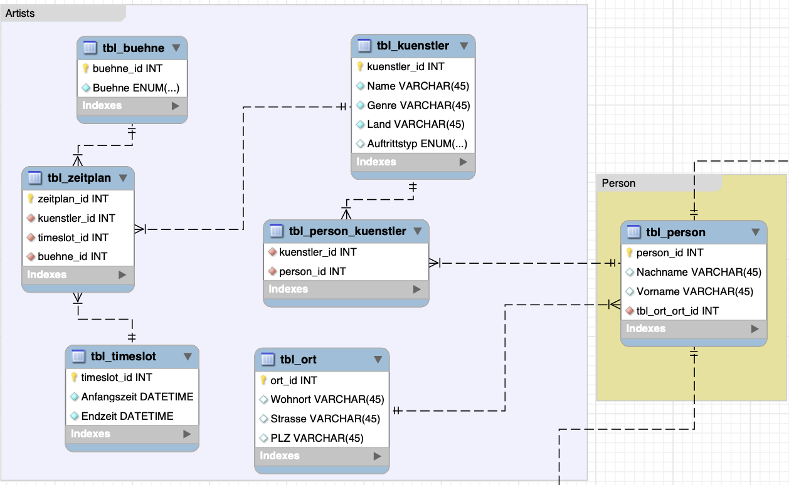

# Überblick ERD

## Bühnenmanagement

Für das Bühnenmanagement war unser Ziel dass wir Künstler Buchen können und sie auf die verschiedenen Bühnen mit einem Zeitplan verteilen können.

Um dieses Management Umzusetzen haben wir eine Tabelle "tbl_zeitplan" erstellt. Diese Tabelle beinhaltet 3 Fremdschlüssel. Die Fremdschlüssel beziehen sich auf die Tablelle "tbl_buehne", die Tabelle tbl_timeslot und die Tabelle "tbl_kuenstler". Diese Tabellen, wie vom Namen her zu vermuten, beinhalten die Bühnen, die Künstler und die definierten Timelots.

Auf der Tabelle Zeitplan existieren 2 Indezes, einer bezogen auf Timeslot und Bühne und der andere auf Timeslot und Künstler. Dies ist so eingerichtet, damit keine Doppelbuchung von Bühnen und Künstler passieren können.

## Kundenmanagement / Ticketmanagement

Für das Kundenmanagement war das Ziel dass wir einen Datenstruktur bieten, mit der Kunden Tickets in einem Onlineshop erwerben können.

Um dies Umzusetzen, haben wir 5 Haupttabellen definiert "tbl_besucher", "tbl_kauefer", "tbl_ticketberechtigungen", "tbl_ticket" und "tbl_tage". Dies erlaubt uns in einer Applikation einen Ticketverkauf zu implementieren, der Tickets für die verschiedenen Festivaltage mit verschiedenen Berechtigungen zur verfügung stellt. Es wurde eine Auftrennung von Käufer und Besucher gemacht, so dass zu einem Ticket ein Käufer und ein Besucher dazugehört. Somit kann eine Person für andere Personen Tickets erwerben.

Es existieren zwei Zwischentabellen. Die Zwischentabelle zwischen Tickets und Ticketberechtigungen, bietet uns die Möglichkeit einem Ticket eine oder mehrere Berechtigungen zuzuteilen. Die zweite Zwischentabelle liegt zwischen Ticket und Tage. Mit dieser Tabelle können wir auf einem Ticket den Zutritt zu einem oder mehreren Tagen definieren.

Es existieren keine spezielle Constraints sondern nur einzelne Not-Null- und Unique-Constraints die anhand von normalen Menschenverstand gesetzt wurden.

## Personalmanagement

Screenshot noch anpassen!

Unser Ziel für das Personalmanagement war, dass die Datenbank die primäre und sekundäre Rolle eines Mitarbeiters erfassen kann und den Arbeitsplan mit Schicht für ein gewisses Datum speichern kann.

Um dieses Management Umzusetzen haben wir eine Tabelle "tbl_mitarbeiter" erstellt. Diese Tabelle beinhaltet 3 Fremdschlüssel. Die Fremdschlüssel beziehen sich zwei Mal auf die Tablelle "tbl_rolle" und auf die Tabelle "tbl_person". In diesen Tabellen geht um die Rollen (primär & sekundär) die ein Mitarbeiter hat.

Diese Implementierung erlaubt uns die Vorgaben, dass ein Mitarbeiter mehrere Rollen hat und eine Schicht einen Hauptmitarbeiter und einer Reserve hat, zu erfüllen.

Wir haben zwei wichtige Constraints auf der Tabelle Arbeitsplan. Wir haben einen Unique auf den fk_schicht und fk_hauptmitarbeiter und einen Unique auf fk_schicht und fk_reserve. Somit können wir die Doppelbuchung von Hauptmitarbeiter und Reservermitarbeiter auf eine Schicht vermeiden.

## Schnittstelle Personen

### Bühnenmanagement

Das Bühnenmanagement hat eine Zwischentabelle "tbl_person_has_tbl_kuenstler" welche die Verbindung von Künstler / Band zu einer Person / mehreren Personen herstellt. Dies existiert damit wir einzelnen Künstler, Duos und Bands mit den beteiligten Personen verbinden können.

### Ticketmanagement

Die zwei Tabellen "tbl_kauefer" und "tbl_besucher" sind direkt mit der Tabelle Personen verbunden. Ein Gedanke der wir hatten war, dass man eine Zwischentabelle zwischen tbl_besucher, tbl_kauefer und Personen machen könnte. Dann könnten Constraints gesetzt werden, die z.B. den Kauf von 20 Tickets von der gleichen Person verhindern könnten. Wir sind jedoch zu der Schlussfolgerung gekommen, dass es besser wäre diese Logik auf die Applikation auzulagern.

### Personalmanagement

Die Tabelle Mitarbeiter ist mit der Tabelle "tbl_person" verbunden. Somit teilt auch dieses System mit den anderen zwei Systemen den gleichen Kern.